# LifeStep · خطوة حياة

**A personal lifestyle coach for people living with chronic disease.**
Lifestyle is a core part of treating chronic diseases, yet most patients are never shown how to change it.
LifeStep asks about the patient's condition and daily habits, builds a personal lifestyle plan, and follows
up with them every day. We started with **diabetes and high blood pressure** (for adults in Saudi Arabia),
based on the main clinical guidelines for each, and built it so more conditions can be added later.

*ForgeHacks, AI + Healthcare track: "make healthcare information clearer, more accessible, and easier to act on."*

> ⚠️ **Not for clinical use.** LifeStep supports, and does not replace, the doctor's plan. Guideline summaries
> were written by the team and **must be checked by a clinician** against the original documents.

## The two reference documents (the only sources)

| Code | Document |
|---|---|
| **ACC/AHA 2017** | Whelton PK, Carey RM, et al. *2017 ACC/AHA/AAPA/ABC/ACPM/AGS/APhA/ASH/ASPC/NMA/PCNA Guideline for the Prevention, Detection, Evaluation, and Management of High Blood Pressure in Adults.* J Am Coll Cardiol 2018;71:e127–e248. |
| **ADA 2026** | American Diabetes Association Professional Practice Committee. *Standards of Care in Diabetes—2026.* Diabetes Care 2026;49(Suppl. 1):S1–S371. |

Every question, rule, goal, meal idea and AI answer cites one of these (section, recommendation or table
number). **Licensing:** neither PDF is in this repo. The ADA document may not be reproduced or used for
text/data mining or machine learning without permission, so LifeStep never sends ADA text to the AI; it uses
short team-written summaries with citations (`knowledge/`). Ask ADA (permissions@diabetes.org) and ACC
before any non-educational use.

## The problem
For chronic diseases like diabetes and high blood pressure, medicine is only part of the treatment. Food,
activity, sleep and daily habits matter just as much. Doctors tell patients to "change your lifestyle", but in
a short visit there's rarely time to explain what that means for this person. Patients go home with questions:
How much salt is too much? Is walking safe with bad knees? What do I do if my sugar drops?

Most health apps don't help much. They give everyone the same advice, they're usually in English, and they
don't say where the advice comes from.

**Who it's for:** adults in Saudi Arabia living with high blood pressure, type 2 diabetes, or both, especially
older patients, and the family members who help care for them.

## Our solution
1. **It asks first.** A short health interview covers the condition, medicines, habits and any limits like
   joint pain or risk of falling. Each question shows why it is asked and which guideline it comes from.
2. **It builds a plan.** The answers become a personal daily, weekly and monthly checklist. Every step
   explains why it matters and cites its source.
3. **It follows up.** The patient ticks off goals and logs blood pressure and blood sugar. If they keep
   missing a goal, the app asks what got in the way and makes the goal easier. If they're doing well, it
   offers the next step.
4. **It keeps them safe.** Dangerous readings or warning symptoms show an alert straight away.

## Impact
- **Makes lifestyle change doable:** small, clear daily steps in the patient's own language instead of general advice.
- **Builds trust:** every recommendation shows its guideline source.
- **Stays with the patient:** the plan changes as they progress instead of staying the same.
- **Helps the doctor:** the monthly report gives real data from home, which makes short clinic visits more useful.

## Features

| | Feature |
|---|---|
| 1 | **Health interview first.** A 3D doctor guide asks one question per screen (≈ 20 of 33, depending on condition). Every question has **"Why do we ask this?"** with its guideline source. Diabetes questions appear only with diabetes; BP questions only with hypertension. |
| 2 | **Personal lifestyle plan** built from the answers by **22 tested rules** (R1–R22), then worded by the AI (Gemini or Claude), with a "built from your history" explanation and source for every decision. |
| 3 | **Checklist**: today grouped by morning / afternoon / evening, plus week and month. Big tick rows; ⓘ shows why, how it was tailored, and the source. |
| 4 | **The app asks you**: an "It's time — have you done this?" card for the goal due now. |
| 5 | **The plan keeps changing**: a goal missed 3 days → "what got in the way?" → made easier; done 6 of 7 days → "ready for the next step?" → stepped up. |
| 6 | **What to eat**: breakfast / lunch / dinner / snack ideas (Saudi dishes made healthier), "Another idea", drinks and foods to limit. Filtered by condition and medicines. Replaces the meal photo. |
| 7 | **Readings**: blood pressure and/or blood sugar logging with trend charts. |
| 8 | **Safety (rules, not AI)**: BP ≥ 180/120 or warning symptoms → full-screen 997 alert; glucose < 70 → treat & recheck in 15 min; < 54 or confused/fainted → urgent/emergency; pregnancy → no plan, see doctor. |
| 9 | **Ask LifeStep (AI)**: questions in Arabic/English ("Can I eat kabsa?", "Does cinnamon lower sugar?") answered only from the guideline summaries, with sources. Emergencies and medicine-dose questions are handled by fixed rules. |
| 10 | **Monthly doctor report**: adherence, BP and glucose summaries, plan changes, one-page PDF. |
| 11 | Water tracker; Arabic-first RTL UI with English; elderly-friendly design; demo patient with 4 weeks of data. |

## Live demo (website)
**Link: https://khutwa-imww.onrender.com** · open it and tap **Try the demo patient**.
(Free hosting: the first visit after a quiet period can take ~1 minute to wake up.)
Hosting: `render.yaml` (Render free web service) serves the API and the pre-built website in `deploy/web/`.
After changing the website code, run `./scripts/build_web.sh` and commit `deploy/web`.

## Quick start
Requirements: Python 3.9+, Flutter 3.22+.
```bash
cd khutwa
./run.sh            # first run: installs backend, builds the web app (~1 min)
```
Open **http://localhost:8000** → **Try the demo patient** (68 y, type 2 diabetes + hypertension) or **Start my plan**.

### Turn on the AI (required for the "AI-powered" parts)
```bash
cp backend/.env.example backend/.env    # then set GEMINI_API_KEY (free, aistudio.google.com) or ANTHROPIC_API_KEY
SKIP_WEB_BUILD=1 ./run.sh
```
The welcome screen shows **"Powered by AI"** when a key is active (otherwise "Demo mode",
which uses fixed templates, still grounded in the same sources).

### Developer mode
```bash
cd backend && .venv/bin/uvicorn app.main:app --reload --port 8000
cd app && flutter run -d chrome --dart-define=API_BASE=http://localhost:8000
cd backend && .venv/bin/python -m pytest          # 34 tests (safety thresholds, rules, sources)
cd backend && .venv/bin/python -m app.intake.export_doc   # regenerate docs/INTAKE_QUESTIONS.md
```

## Demo script (3 minutes)
1. Welcome (Arabic, RTL) → **Try the demo patient**.
2. The app asks why "move every 30 minutes" was missed → answer → the goal is adapted.
3. Home: morning / afternoon / evening goals; the **"It's time"** card; tick a goal; ⓘ shows the ADA/ACC source.
4. **Readings → Sugar**: enter 50 → urgent low-sugar alert (ADA Table 6.4). **Pressure**: enter 190 → 997 alert.
5. **Food**: today's Saudi meal ideas, "Another idea", drinks/limit cards.
6. **Ask**: "هل القرفة تخفض السكر؟" ("Does cinnamon lower sugar?") → answer citing ADA rec 5.16.
7. **Report**: adherence, BP 155/94 → 142/85, glucose 79% in 70–180, PDF for the doctor.

## Architecture

```mermaid
flowchart LR
  subgraph FE["🌐 Website (Flutter web)"]
    direction TB
    F1["Health interview (rendered from /api/intake)"]
    F2["Checklist: time-of-day groups, Now card, adapt prompts"]
    F3["Readings: BP + glucose, charts"]
    F4["Food guide · Ask LifeStep · Report"]
    F5["Emergency screen + offline rule mirror"]
  end
  subgraph API["⚙️ Backend API (FastAPI)"]
    direction TB
    A1["/intake /onboarding /plan /checklist /adapt"]
    A2["/bp /glucose /meals /ask /water"]
    A3["/report(.pdf) · auth (demo | Firebase)"]
  end
  subgraph RULES["📏 Decision rules (code, tested)"]
    direction TB
    R1["R1–R22 from ACC/AHA 2017 + ADA 2026"]
    R2["Goal priority: safety → patient's answers → rest"]
  end
  subgraph AI["🧠 AI & retrieval"]
    direction TB
    K1["knowledge/hypertension (ACC/AHA) · knowledge/diabetes (ADA)"]
    K2["Local TF-IDF retrieval per condition"]
    K3["LLM (Gemini / Claude): plan wording, adaptation, Ask LifeStep"]
    K4["Grounding guard: drop goals citing un-allowed entries"]
  end
  subgraph SAFE["🚨 Safety engine (no AI)"]
    direction TB
    S1["BP ≥ 180/120, warning symptoms"]
    S2["Glucose < 70 / < 54, severe symptoms"]
    S3["Pregnancy exclusion"]
  end
  subgraph DATA["🗄️ Data"]
    direction TB
    D1["Local JSON (default) | Firestore"]
    D2["Seed: demo patient (both conditions)"]
  end
  FE --> API --> RULES --> AI
  API --> SAFE
  API --> DATA
  AI -- "Gemini API / Anthropic API" --> C[("LLM")]
```



## How AI is used, and what it never does
| AI does | Rules decide (never AI) |
|---|---|
| Words each goal in plain Arabic/English and personalises it | Which goals are allowed / forbidden for this patient (R1–R22) |
| Adapts a goal to the patient's reason, or steps it up | When to ask (3 misses / 6 of 7 days) |
| Answers patient questions from the guideline summaries | Emergencies (BP, glucose, symptoms), pregnancy, medicine-dose questions |

AI provider: **Google Gemini** (`gemini-flash-latest`, free tier, JSON-schema output; key from `GEMINI_API_KEY`) on the live demo.
Claude (`claude-opus-5-5`, structured outputs) is used instead when `ANTHROPIC_API_KEY` is set. Keys come from environment variables only.
Any AI error falls back to the offline templates.

## Reliability
See **[docs/INTAKE_QUESTIONS.md](docs/INTAKE_QUESTIONS.md)**: every question, its source, the rule it feeds,
and an honest reliability table. In short: thresholds and lifestyle targets come straight from numbered
recommendations and are unit-tested; the question wording and the combination of two guidelines are ours
and **not clinically validated**; team-authored meal ideas and Saudi examples need dietitian review.

## Limitations
- Self-reported answers; questions are not a validated instrument.
- Not validated with patients or clinicians; Arabic wording needs testing with older Saudi users.
- The PDF report is English-only. No notifications or device (Bluetooth/CGM) integration yet.
- Demo auth (`X-User-Id`) is not secure; use `KHUTWA_AUTH=firebase` for anything beyond a demo.
- ADA/ACC permission is needed for non-educational use of their content.

## What's next
LifeStep is built so a new condition can be added as a new module with its own guideline and rules
(`backend/app/diseases/`). Next we want to add heart failure and kidney disease, a Ramadan fasting plan
(with clinicians), connections to glucose and blood pressure devices, voice input and read-aloud, and a
dashboard for clinicians. Before use with real patients, the rules need review by doctors and testing with
older patients.

## Tech stack
Flutter 3 web (fl_chart, image assets: Microsoft Fluent Emoji 3D – MIT; Tajawal font – OFL) · Python FastAPI ·
Google Gemini API / Anthropic Claude API · local TF-IDF retrieval · Firebase (optional) · fpdf2.
